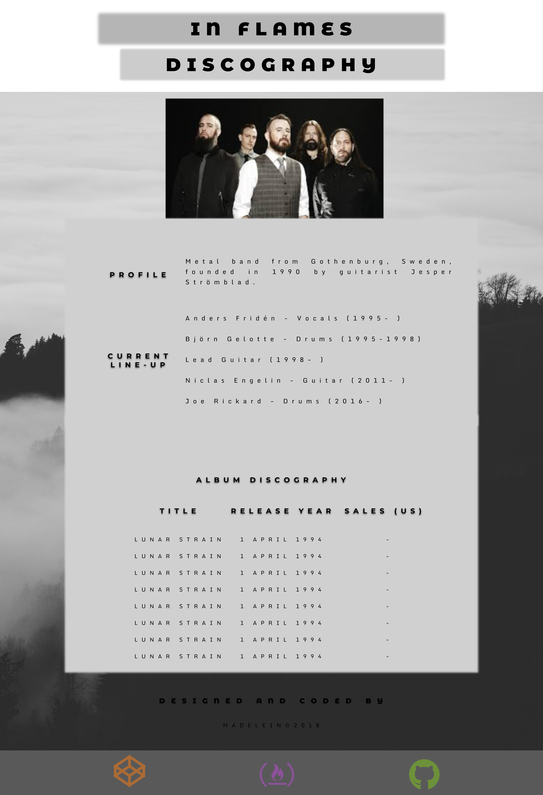
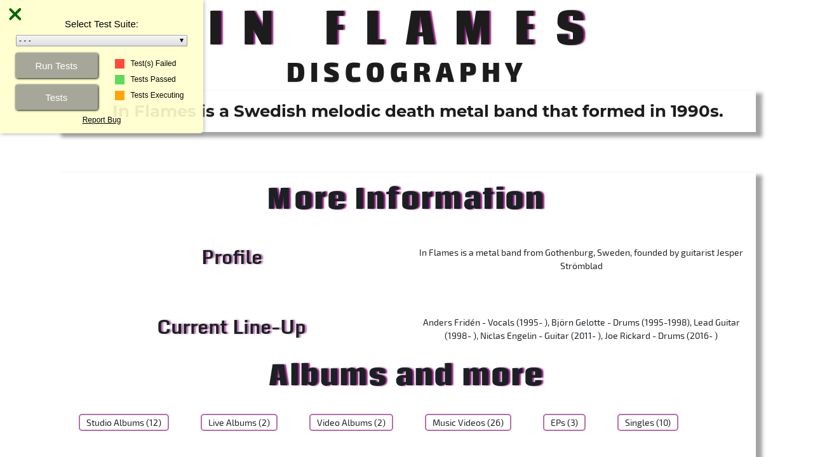

# FCC (FreeCodeCamp) - Tribute Page
---

## Project Objective
Build an app that is *functionally* similar to this: https://codepen.io/freeCodeCamp/full/zNqgVx.

***

## Requirements
#### Requirement Number One:
My tribute page should have an element with a corresponding ```id="main"```, which contains all other elements. It should contain an element ```id="title"```, which contains a string.

#### Requirement Number Two: 

I should see a ```div``` element with a corresponding ```id="img-div"```. Within the ```img-div element```, I should see an img element with a corresponding ```id="image"```, ```id="img-caption"```.

#### Requirement Number Three: 
I should see an element with a ```id="tribute-info"```, which contains textual content describing the subject of the tribute page & an element with ```id="tribute-link"```, which links to an outside site that contains additional information about the subject of the tribute page

#### Requirement Number Four: 
The img element should responsively resize, relative to the width of its parent element, without exceeding its original size.It should also be centered within its parent element.

***

## Project Install Requirements

- **NodeJS - [NodeJS](http://nodejs.org)** - Follow the prompts to install
- **Gulp - [GulpJS](https://gulpjs.com/)**
```
npm install -g gulp
```

***

## Start Project
Run the following command: 
```
npm install
```

***

## How to use the project
Open your terminal and type gulp. This will run the ```gulpfile``` and ensure that all the compilers are working and watching for any changes taking place.

Here are other commands that you can run.

* **default**: Compile and watch for changes
* **scripts**: Compile the JavaScript files
* **sass**: Compile the Sass styles
* **images**: Copy the newer to the build folder
* **vendors**: Copy the vendors to the build folder
* **watch**: Watch for any changes on the each section

The `gulp` command is the best choice for you most likley.

***

## Project Starter Kit
Courtesy of: **Jesse Showalter** 
Go check out his [YouTube](https://www.youtube.com/watch?v=sr6jDeAoXCc&feature=youtu.be&list=PLrtjkLnNjGHu7QIc8jN7hZmuP6wMby2QZ) channel for more information and awesome content.

## Project Thumbnails:




